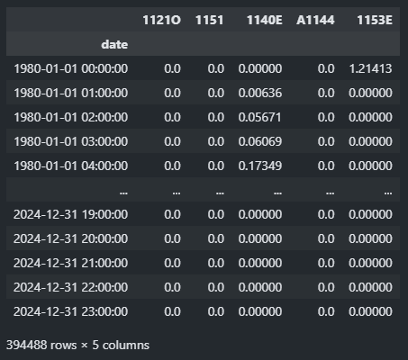
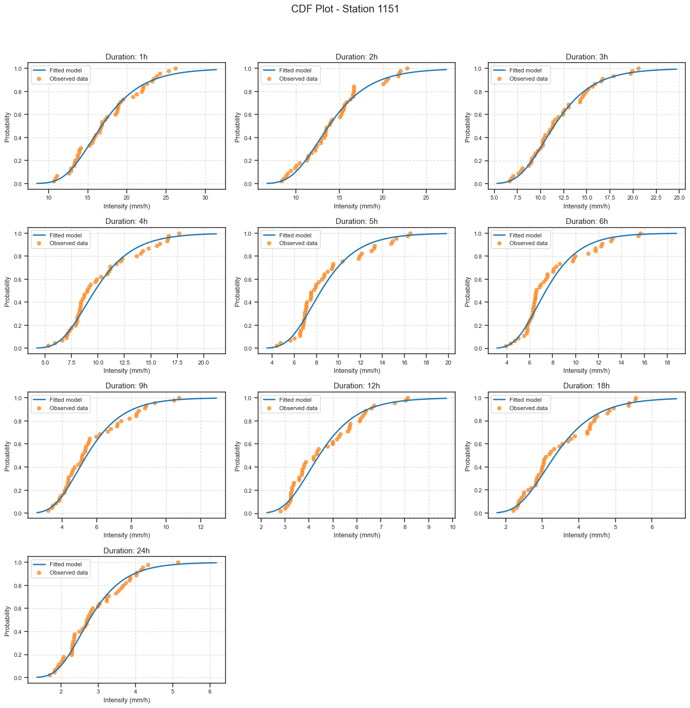
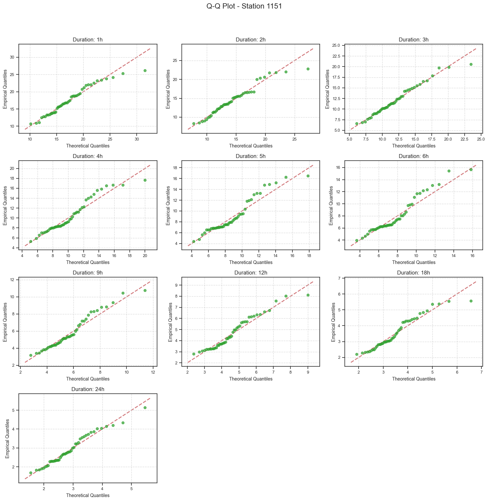
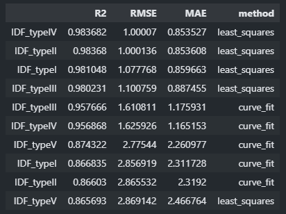
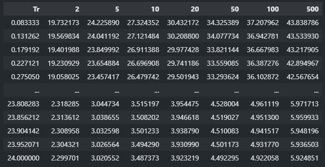
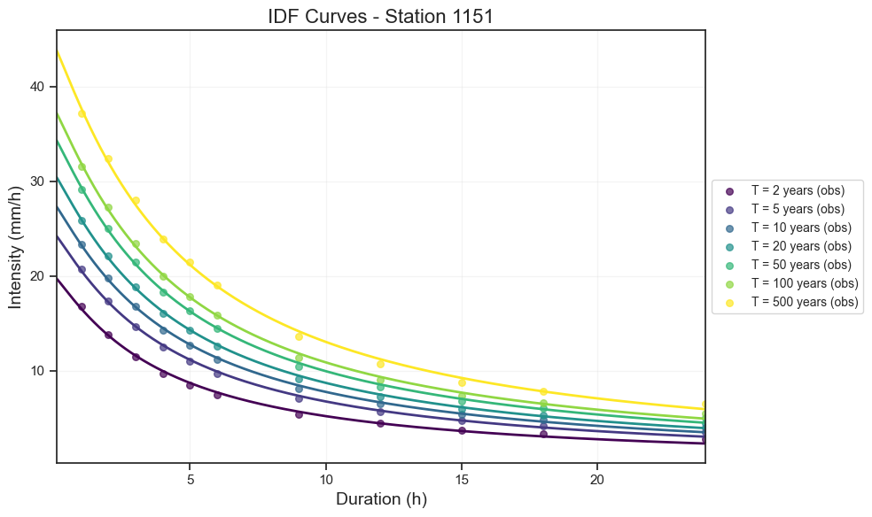
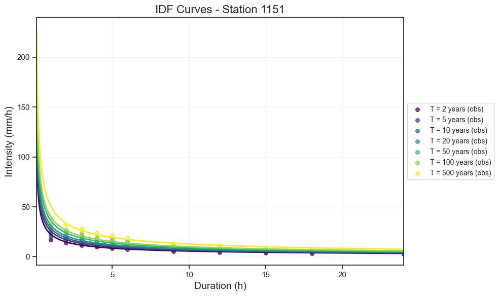

# IDF Analysis Tool

## Table of Contents
- [IDF Analysis Tool](#idf-analysis-tool)
  - [Table of Contents](#table-of-contents)
  - [Introduction](#introduction)
  - [Installation](#installation)
  - [Usage](#usage)
  - [Class: IDFAnalysis](#class-idfanalysis)
  - [Examples](#examples)
    - [**Step 1: Prepare Your Data**](#step-1-prepare-your-data)
    - [**Step 2: Initialize the IDF Analysis Class**](#step-2-initialize-the-idf-analysis-class)
      - [Plot CDF Models](#plot-cdf-models)
      - [Plot Q-Q Models](#plot-q-q-models)
      - [Fitting Model Overview `model`](#fitting-model-overview-model)
      - [Statistical distributions `distribution`](#statistical-distributions-distribution)
    - [**Step 3: Select a Model for Fitting the IDF Curve**](#step-3-select-a-model-for-fitting-the-idf-curve)
      - [IDF Equations Overview `IDF_type`](#idf-equations-overview-idf_type)
        - [_IDF Equation Type I_](#idf-equation-type-i)
        - [_IDF Equation Type II_](#idf-equation-type-ii)
        - [_IDF Equation Type III_](#idf-equation-type-iii)
        - [_IDF Equation Type IV_](#idf-equation-type-iv)
        - [_IDF Equation Type V_](#idf-equation-type-v)
    - [**Step 4: Get IDF Table for selected fit model**](#step-4-get-idf-table-for-selected-fit-model)
    - [**Analyze IDF Curves**](#analyze-idf-curves)
  - [Visualizations](#visualizations)
  - [Contributing](#contributing)
  - [License](#license)

## Introduction

The IDF Analysis Tool is a Python-based solution for performing Intensity-Duration-Frequency (IDF) analysis on rainfall data. This tool encapsulates methods for calculating annual maximum intensities, fitting statistical models, generating IDF curves, and plotting results.

IDF analysis is crucial in hydrological studies and water resource management, providing essential information for the design of drainage systems, flood control structures, and other water-related infrastructure.

## Installation

To use the IDF Analysis Tool, you need to have Python installed on your system. Additionally, you'll need to install the following dependencies:

```bash
pip install pandas numpy scipy matplotlib fitter statsmodels
```

You'll also need to ensure you have the `Julia_Genextreme` module available in your Python environment.

## Usage

To use the IDF Analysis Tool, you need to import the `IDFAnalysis` class from the module:

```python
from idf_analysis import IDFAnalysis
```

## Class: IDFAnalysis

The `IDFAnalysis` class is the core of this tool. It takes the following parameters during initialization:

- `historic_hourly`: A pandas DataFrame containing historical hourly rainfall data.
- `Durations`: A numpy array of durations to analyze (in hours).
- `Return_periods`: A numpy array of return periods to calculate.
- `distribution`: The statistical distribution to use for fitting (default is 'genextreme').
- `model`: The model engine to use for fitting ('scipy_stats' or 'Julia_stats', default is 'scipy_stats').
- `method`: The method for fitting IDF curves ('curve_fit' or 'least_squares', default is 'curve_fit').
- `IDF_type`: The type of IDF equation to use (default is 'IDF_typeI').


## Examples

Let's walk through a step-by-step example of how to use the IDF Analysis Tool:

### **Step 1: Prepare Your Data**

First, you need to prepare your historical hourly rainfall data in a pandas DataFrame format. Each column should represent a station, and the index should be the datetime.

```python
import pandas as pd
import numpy as np

# Load your data (replace with your actual data loading method)
historic_hourly = pd.read_csv('Rainfall.csv', index_col=0, parse_dates=True)
historic_hourly
```


```python
# Define durations and return periods
Durations = np.array([1, 2, 3, 6, 12, 24])  # in hours
Return_periods = np.array([2, 5, 10, 25, 50, 100])  # in years
station = historic_hourly.columns[1] # Select a station
station
```
1151

### **Step 2: Initialize the IDF Analysis Class**

```python
data = historic_hourly[[station]]
idf_analysis = IDFAnalysis(data, 
                           Durations, 
                           Return_periods, 
                           model='scipy_stats', 
                           distribution='gumbel_r')
```
#### Plot CDF Models

```python
cdf_plot = idf_analysis.plot_cdf_models(station_name)
cdf_plot.savefig('cdf_plot.png')
```



#### Plot Q-Q Models

```python
qq_plot = idf_analysis.plot_qq_models(station_name)
qq_plot.savefig('qq_plot.png')
```



#### Fitting Model Overview `model`

The distributions are available in both `scipy_stats` and `Julia` packages. 

> ⚠️ **Note:** The `Julia` package is only available for the `genextreme` distribution. This is because the `scipy_stats` package sometimes encounters issues with the `genextreme` distribution.

#### Statistical distributions `distribution`

Commonly used distributions include the **Generalized Extreme Value** (`genextreme`) and the **Gumbel distribution** (`gumbel_r`), which are frequently applied in **extreme value analysis**.

### **Step 3: Select a Model for Fitting the IDF Curve**

In this step, you can choose a statistical model to fit the IDF curve. The available models are `curve_fit`, `least_squares`, and `potential_regression`.

> ⚠️ **Note:** The `curve_fit` and `least_squares` methods are applicable to all IDF equations. However, the `potential_regression` method is only applicable to the Type V IDF equation.

By setting the `method` parameter to `'all'`, you instruct the analysis to evaluate the fit using all available methods: `curve_fit`, `least_squares`, and `potential_regression`. The output will be a summary table with the goodness-of-fit metrics for each method.

```python
goodness = idf_analysis.goodness_of_fit(station, method='all')
goodness
```


#### IDF Equations Overview `IDF_type`

The Intensity-Duration-Frequency (IDF) equations are used to model the relationship between rainfall intensity, duration, and return period. Below are different types of IDF equations, each varying slightly in how they model these relationships.

##### _IDF Equation Type I_
The equation for IDF Type I is defined as:

$$
I = \frac{d \cdot T + e}{(D + c)^b}
$$

- $T$: Return period.
- $D$: Duration.
- $b$, $c$, $d$, $e$: Parameters of the equation.
- $I$: Rainfall intensity.

##### _IDF Equation Type II_
The equation for IDF Type II is defined as:

$$
I = \frac{d \cdot T + e}{(D^b + c)}
$$

- $T$: Return period.
- $D$: Duration.
- $b$, $c$, $d$, $e$: Parameters of the equation.
- $I$: Rainfall intensity.

##### _IDF Equation Type III_
The equation for IDF Type III is defined as:

$$
I = \frac{d \cdot T^e}{(D + c)^b}
$$

- $T$: Return period.
- $D$: Duration.
- $b$, $c$, $d$, $e$: Parameters of the equation.
- $I$: Rainfall intensity.

##### _IDF Equation Type IV_
The equation for IDF Type IV is defined as:

$$
I = \frac{d \cdot T^e}{(D^b + c)}
$$

- $T$: Return period.
- $D$: Duration.
- $b$, $c$, $d$, $e$: Parameters of the equation.
- $I$: Rainfall intensity.

##### _IDF Equation Type V_
The equation for IDF Type V is defined as:

$$
I = \frac{d \cdot T^e}{D^b}
$$

- $T$: Return period.
- $D$: Duration.
- $b$, $d$, $e$: Parameters of the equation.
- $I$: Rainfall intensity.
  
### **Step 4: Get IDF Table for selected fit model**

It's necessary to select the model and IDF equation type that best fit the distribution and the IDF curve data, based on the results from Step 3, to generate the most accurate IDF table.

```python
idf_model = IDFAnalysis(data, Durations, Return_periods, distribution='gumbel_r', model='scipy_stats', method='least_squares', IDF_type='IDF_typeIV')
```

To obtain the IDF table and figure, you can use the `IDF_fit()` method:

```python
table_idf, idf_fig = idf_model.IDF_fit(station, plot=True)
```

Table_idf



Idf Figure




### **Analyze IDF Curves**

In this step, we selected the model that best fits the curves based on our data. However, upon analyzing the behavior in the figure, it's evident that the fit for durations under one hour is quite poor. This issue arises because our data only has an hourly resolution. Ideally, we would obtain rainfall data with minute-level resolution. In such a case, we could use a different model as an alternative to improve the accuracy of the fit during the first minutes, particularly for durations shorter than an hour.

The poor fit in the first few minutes before completing the first hour is due to the low temporal resolution of the data, which only provides hourly information. This limitation prevents us from accurately capturing the high variability that occurs early on. In the literature, alternative approaches such as potential regression, using Equation 5, are recommended to model the increasing intensity typically observed in the initial minutes of an event. Although this approach may not achieve the best fit with the available data, it likely provides a more accurate representation of the intensity during those critical minutes before the first hour is reached. Below, we provide an example of how to apply this method.

```python
idf_model = IDFAnalysis(data, Durations, Return_periods, distribution='gumbel_r', model='scipy_stats', method='least_squares', IDF_type='IDF_typeIV')
```

To obtain the IDF table and figure, you can use the `IDF_fit()` method:

```python
table_idf, idf_fig = idf_model.IDF_fit(station, plot=True)
```
Idf Figure




## Visualizations

The IDF Analysis Tool provides several types of visualizations to help interpret the results:

1. **CDF Plots**: These plots show the cumulative distribution function of the fitted model compared to the observed data for each duration.

2. **Q-Q Plots**: These plots compare the quantiles of the theoretical distribution to the quantiles of the observed data, helping to assess the goodness of fit.

3. **IDF Curves**: These plots show the fitted IDF curves along with the observed data points, allowing for visual comparison of the model fit to the data.

## Contributing

Contributions to the IDF Analysis Tool are welcome! Please feel free to submit pull requests, create issues, or suggest improvements.

## License

...

---

This README provides a comprehensive guide to using the IDF Analysis Tool. For more detailed information about specific methods or advanced usage, please refer to the inline documentation in the source code.
